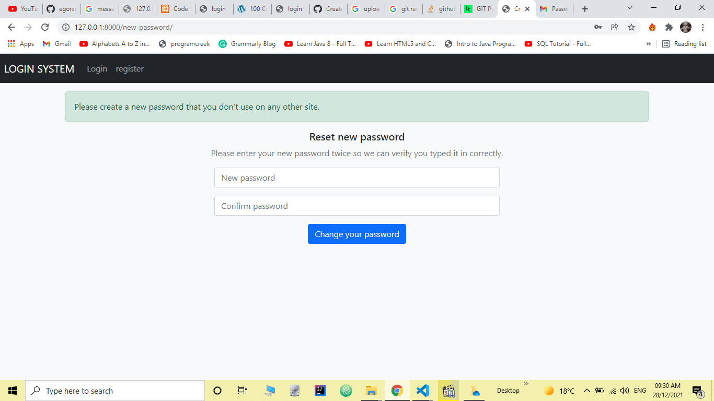

# Simple Django Login and Registration

An example of Django project with basic user functionality.

## Screenshots

| Log In | Create an account | Authorized page |
| -------|--------------|-----------------|
|  |  |  |

| Password reset | verifying page | Password change |
| ---------------|------------------|-----------------|
|  |  |  |

## Functionality

- Log in
  - via username & password
  - via email & password
  - via email or username & password
- Create an account
- Log out
- Profile activation via email
- Reset password

## Installing

### Clone the project

```git
git clone https://github.com/Ho011/django-login-and-register.git
```

### Install dependencies & activate venv

unix / mac

``` python
python3 -m pip install --user virtualenv
```

windows

```python
py -m pip install --user virtualenv
```

create a virtual environment

unix / mac

```pyhton
python3 -m venv env
```

windows

```pyhton
py -m venv env
```

And tell pip to install all of the packages in this file using the -r flag:

unix / mac

``` python
python3 -m pip install -r requirements.txt
```

windows

```python
py -m pip install -r requirements.txt
```

### Configure the settings (connection to the database, connection to an SMTP server, and other)

1. Edit `core/settings.py` if you want to develop the project.

2. Create .env file in `core/` and add your environment variable

3. Apply migrations

#### A development server

Just run this command:

``` python
python manage.py runserver
```
